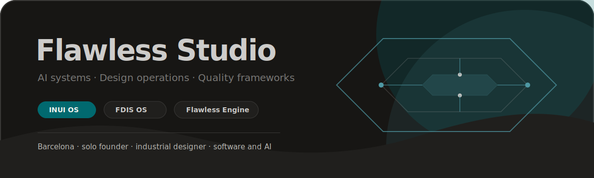

  

<h1 align="center">Flawless Studio</h1>

  Solo founder · Industrial designer · AI systems & design ops 
  Building the Flawless ecosystem: INUI OS · AionUi · Flawless Engine · FDIS OS

  <a href="https://github.com/flawlessstudio/flawless-ecosystem"><strong>Ecosystem map</strong></a>
  ·
  <a href="mailto:oneflawlessstudio@gmail.com"><strong>Contact</strong></a>

---

## Focus

| System layer | Repositories |
|---|---|
| Apex systems | [`flawless-product-development-system`](https://github.com/flawlessstudio/flawless-product-development-system) · [`aionui-inuios-system`](https://github.com/flawlessstudio/aionui-inuios-system) |
| Operating systems | [`inui-os`](https://github.com/flawlessstudio/inui-os) · [`fdis-os`](https://github.com/flawlessstudio/fdis-os) · [`flawless-northstar-os`](https://github.com/flawlessstudio/flawless-northstar-os) |
| Quality frameworks | [`universal-software-quality-system`](https://github.com/flawlessstudio/universal-software-quality-system) · [`flawless-filters`](https://github.com/flawlessstudio/flawless-filters) |
| Tools and agents | [`flawless-engine`](https://github.com/flawlessstudio/flawless-engine) · [`flawless-agents`](https://github.com/flawlessstudio/flawless-agents) · [`repo-analyst-mvp`](https://github.com/flawlessstudio/repo-analyst-mvp) |

## Stack

  
  
  
  
  
  
  
  

## GitHub signal

  
  

---

  Open to collaboration on design systems, AI agent architectures, document intelligence, and quality frameworks.

